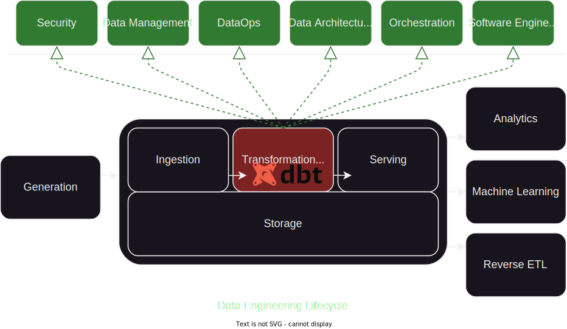
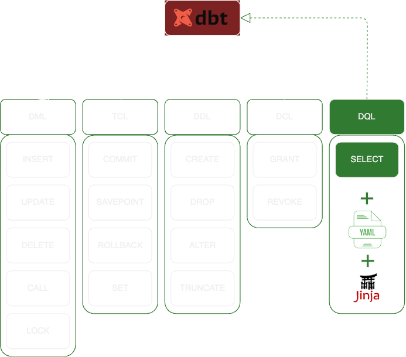
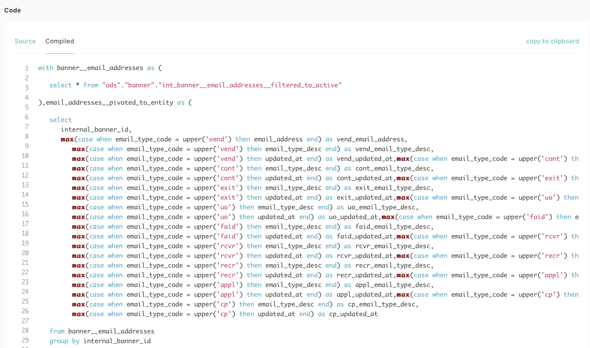
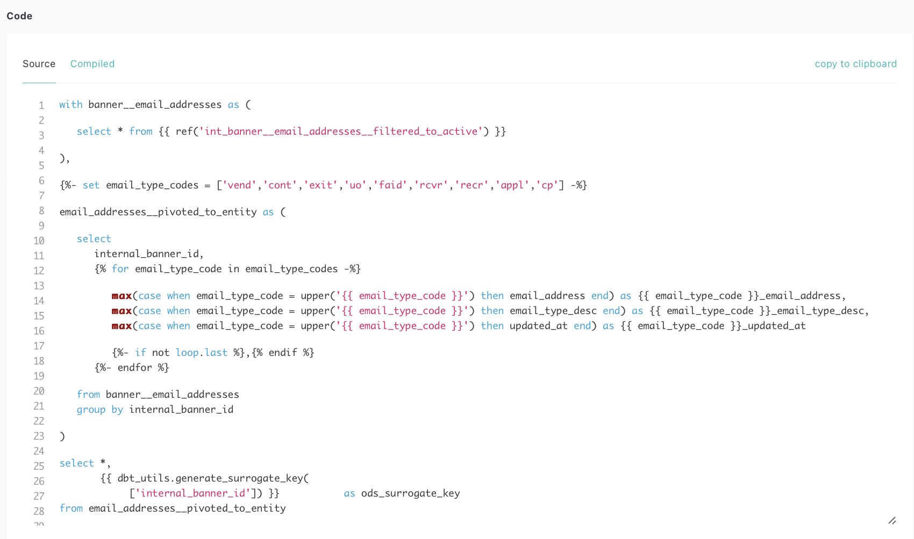
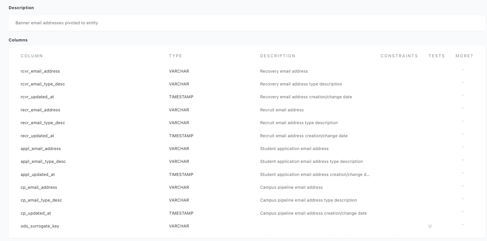
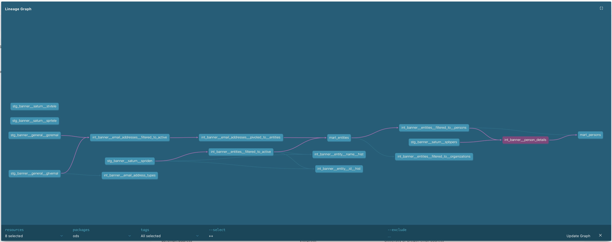
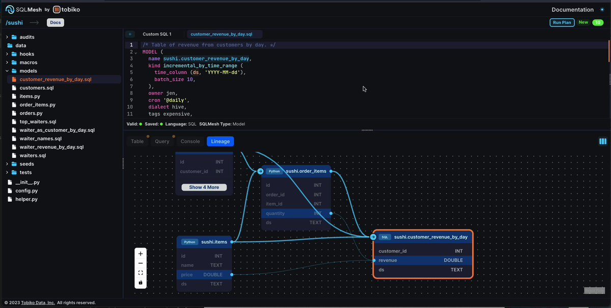

## What is DBT?

**DBT (Data Build Tool)** is an open-source `SQL` management tool designed specifically for **data transformation**. 

??? question "DBT Cloud vs. DBT Core"

    [DBT Cloud](https://www.getdbt.com){:target="_blank"} was released in 2018 as a paid-managed offering, however their **free** [DBT Core](https://github.com/dbt-labs/dbt-core){:target="_blank"} product continues to recieve improvements aided by a vibrant open-source community and increasing adoption as the industry-standard in data transformation.
    
    **DBT Cloud** wraps the functionality of **DBT Core** with managed **DevOps** and **IDE** capabilities, and supports the use of Python in addition to SQL for data transformations.

    Geared for cloud-managed datawarehouse platforms, DBT Cloud lacks integration with [Microsoft and Oracle](https://www.getdbt.com/product/integrations){:target="_blank"} (both cloud and on-premise).

    Single-seat **DBT Cloud** developer licenses are free (limited functionality), and paid-licenses exist for **Teams** and **Enterprises**.  Details for each tier change frequently, see [DBT Pricing](https://www.getdbt.com/pricing){:target="_blank"} for more information.

    &#x2757;**DBT Core** has integration with [just about every platform](https://docs.getdbt.com/docs/supported-data-platforms){:target="_blank"}, and DIY DevOps are [well-documented](https://paulfry999.medium.com/v0-4-pre-chatgpt-how-to-create-ci-cd-pipelines-for-dbt-core-88e68ab506dd){:target="_blank"}.

    

    **UofO Information Services ODS** implements **DBT Core**, with [DevOps](../../devops/_devops.md){:target="_blank"} supported **in-house** using **Jenkins** and **BitBucket**.

    &#x2757;DBT's documentation often mixes both Cloud and Core, and **differences are noticiable and important**.

## SQL Manager?

That's right. 

DBT enables analytics engineers to transform data in their warehouses by turning `SELECT` statements (with configuration in `YAML`, and dynamism with `Jinja`), into well-governed **tables and views**. 

**DBT's** prime function is managing a large collection of small SQL `SELECT` scripts. 

Traditional **SQL Development** is painfully tied to [Database Management Tools](https://in.indeed.com/career-advice/career-development/database-management-tools){:target="_blank"}, used as code IDEs. These predominently **Low-Code/GUI-First** experiences struggle to exploit advancements in ***powerful problem-solving techniques*** commonly utilized in software development.

DBT is a **Code-First/GUI-Descriptive** development experience, addressing [big topics](../../big_topics/_big_topics.md){:target="_blank"} such as Data Literacy, Institutional Knowledge, Data Quality, and Technical Staffing, 

**Code-first/GUI-Descriptive** doesn't mean DBT has higher a technical bar for adoption/collaboration, but quite the opposite, as it places **basic** SQL knowledge as the **core competency** for development.  DBT is a tool for:

- &#x2705; Report Writers
- &#x2705; Business Analysts
- &#x2705; ERP Developers
- &#x2705; Application Service Managers

... all who traditionally maintain **basic** SQL knowledge, but more importantly, extensive **domain knowledge**.  DBT tightly couples **singular-purpose SQL statements** and dependencies, with atomic **business defintions and declarative expectations**.

DBT is an orchestration framework for chaining DRY (**don't repeat yourself**) SQL statements, adorned with **robust testing/metadata/lineage**, and extensive platform interoperability.

## Custom DBT Metadata Website

DBT provides **static webpage assets** as an interactive website built from DBT transformations and metadata.  This website serves as a self-service metadata portal into everything DBT touches and nearly every aspect of the developed codebase:

SQL(1) and [Jinja](https://docs.getdbt.com/docs/build/jinja-macros){:target="_blank"}(2)
{ .annotate }

1. 
2. 

Descriptions for Sources, Tables, Views, Columns, etc.(1)
{ .annotate }

1. 

Ownership and Access Contols

Table/View Lineage(1)
{ .annotate }

1. 

Data Quality Tests

!!! note annotate "" 
    Many open-source tools ingest DBT to provide further GUI perspectives and enhancements, such as:

    [SQLMesh](https://sqlmesh.com){:target="_blank"}(1)

    [Elementary](https://www.elementary-data.com){:target="_blank"}(2)

    [Open Metadata](https://open-metadata.org){:target="_blank"}

    [PipeRider](https://www.piperider.io){:target="_blank"}

1. 
2. 

## DBT Developer Documentation

We think DBT's great, but...

!!! tip "Don't take our word for it...read on!"

    DBT's-own [What is DBT?](https://docs.getdbt.com/docs/introduction){:target="_blank"} is far better than anything we could write.

    Their documentation is outstanding, and this is a great place to start.
