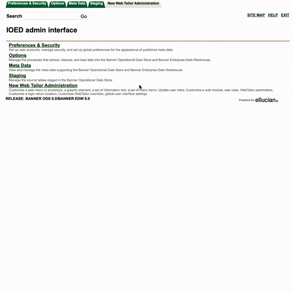

## Overview

After a Banner PROD-to-TEST clone, ODS environments fed by Banner TEST (IOED & IOET) require a Full ODS Reload.

## Preliminary Actions

These steps outline actions taken by DDS DEs to set/validate temporary configurations required for `Restaging Materialized Views` and `Reloading Reporting Tables`.

1. **Verify removal of scheduled IA_Admin Jobs**:(1)
{ .annotate }
    1. IOED/T needs all activity stopped before the clone process begins; DBAs manually remove them.            
    
        These frequency-scheduled jobs will be re-instutited after a success full reload, emulating their schedule/configuration from IOEP.


    ``` sql
    select 'GOOD TO GO'
    from dual 
    where not exists (select * 
				      from sys.dba_jobs 
				      where sys.dba_jobs.job not in (select job 
                                                     from sys.dba_jobs_running));	
    ```

2. **Verify DDS DEs granted 'DBA' role**:(1)
{ .annotate }
    1. Temporarily granted by DBA staff to DDS DEs to perform subsequent steps of the full reload process

    ``` sql
       select 'GOOD TO GO'
       from dba_role_privs
       where grantee       = user
         and granted_role  = 'DBA'
    ```


3. **Change default namespaces to MVLOG for Banner schemas**:(1)
{ .annotate }
    1. `MVLOG` is an Oracle tablespace with additional storage compared to the normal module-specific Banner tablespaces.  
    
        While normally MView logs are purged on an hourly/daily frequency, the full reload process may take up to 1.5 weeks resulting in larger-than-normal MView logs accumulated, impacting Oracle FLASH memory allocation to the point of failure.  
        
        After a full reload is complete, this change is reverted.

    ``` sql
    alter user FIMSMGR default tablespace MVLOG;
    alter user GENERAL default tablespace MVLOG;
    alter user TAISMGR default tablespace MVLOG;
    alter user ALUMNI default tablespace MVLOG;
    alter user SATURN default tablespace MVLOG;
    alter user FAISMGR default tablespace MVLOG;
    alter user PAYROLL default tablespace MVLOG;
    alter user POSNCTL default tablespace MVLOG;
    alter user HOUSMGR default tablespace MVLOG;   
    ```

4. **Restage SPRIDEN**(1):
{ .annotate }
    1. This serves as a 'smoke-test' to confirm correct configurations; validated in subseqent steps.

    In [IA_Admin for IOED](https://testweb.uoregon.edu/odsedwdev/twbkwbis.P_GenMenu?name=bmenu.P_MainMnu){:target="_blank"}/[IA_Admin for IOET](https://testweb.uoregon.edu/odsedw/twbkwbis.P_GenMenu?name=bmenu.P_MainMnu){:target="_blank"}, restage the `SATURN.SPRIDEN` ODS Materialized View:
    
    ??? note annotate "Steps to Restage Single Materialized View(s)" 
        <div class="grid" markdown>

        


        1. Select **"Staging"** upper tab
        - Select **"Reconcile Stage Tables"**
        - Select **"Reconcile by Table Name"**
        - Ensure **"Source Database"** = BPRA_IOED (TEST.WORLD)
        - Select desired table(s) from **"Which Table(s)"**
        - Set **"Action"**" = **"Restage All Selected Tables"**
        - Deselect (all):
            -   **"Compile Invalid Objects?"**
            -   **"Execute All Apply Errors?"**
            -   **"Refresh All MViews?"**
        - Schedule to run immediately by clicking the***"here"***  link for Run Date/Time
        - Select **"Submit"**
        - Monitor job execution by selecting **"Options"**upper    tab
        - Select **"View Control Reports"**
        
        </div>
    
