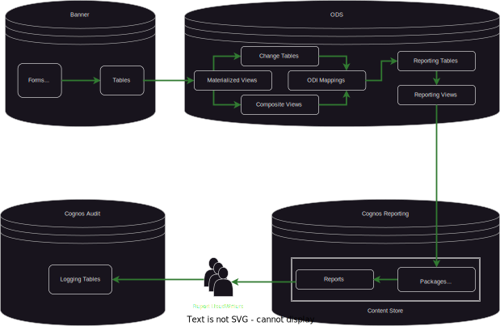

## Overview

The daily refreshing process for the Ellucian Banner Operational Data Store (ODS) Data Warehouse involves a series of systematic steps aimed at extracting, transforming, and loading data from various source systems into the ODS Data Warehouse. Below is a brief overview of the key stages involved:

1. **Extraction**:
     - Data extraction involves retrieving relevant data from Banner Student Information System, Finance, Human Resources modules, and Financial Aid.
     - Ingestion methods involve incremental extraction to capture only changes since the last refresh (previous day), reducing processing time and resource consumption compared to a full reload which can take up to several days.

2. **Transformation**:
     - Extracted data undergoes transformation compatibile with the data model of the ODS Data Warehouse.
     - Transformations include data enrichment, normalization, and aggregation to standardize formats.

3. **Loading**:
     - Transformed data is loaded into the ODS Data Warehouse Tables, using an Orace Data Integrator mappings and IA_Admin orchestration.
     - Loading mechanisms involve parallel processing to optimize performance and accommodate large volumes of data within the scheduled refresh window.

4. **Indexing and Optimization**:
     - Once data is loaded, indexing and optimization techniques are applied to enhance query performance and facilitate efficient data retrieval.
     - Indexing strategies may vary based on the nature of queries commonly executed against the ODS Data Warehouse.

5. **Monitoring and Maintenance**:
     - Continuous monitoring is essential to ensure ongoing stability and performance of the ODS Data Warehouse.
     - Maintenance tasks such as data purging, index rebuilding, and system tuning are performed periodically to optimize resource utilization and maintain data integrity.

6. **Consumption and Security**
     - ODS Data Warehouse Tables are transformed further for ease-of-consumption and provided to users through Direct Database SQL Access, or IBM Cognos.
     - Cognos pre-joins/aggregates/filters data for semantic-layer modeling in Cognos Framework Manager, and Cognos Modules.
     - Security is applied to data, Cognos Content Store directories and reports, and Cognos Capabilities (Report Consumer vs. Author).

## Components

=== "Banner"
    
    The following manipulate data stored in `Banner Oracle tables`:

    * [Admin Forms](https://git.uoregon.edu/projects/ISBE){:target="_blank"} internal-facing for data maintenance and processing by UO staff.
    * [Self-Service](https://git.uoregon.edu/projects/ISBA){:target="_blank"}  (DuckWeb) front-facing site for Student, Parents, Employees.
    * [AppWorx](https://techdocs.broadcom.com/us/en/ca-enterprise-software/intelligent-automation/applications-manager/9-3/User_Guide/.Applications_Manager_Operations/Using_the_Applications_Manager_Desktop.html){:target="_blank"} (BroadCom Application Manager) job-chain process scheduler.
    

=== "ODS"

    Oracle DB Objects:

    * `Materialized Staging Views`: copies of `Banner Oracle Tables` across database links updated every 30 minutes.
    * `Composite Views`: Transformation JOINs of `Materialized Staging Views` for used in loading to `Reporting Tables`.
    * `Change Tables`: Tables storing changes to `Materialized Staging Views` since last reload/refresh.
    * `Change Table Triggers`: Store `Materialized Staging View` record keys for inserts, updates, and deletes in Banner.
    * Oracle Data Integrator `ODI Mappings`: Jobs which load `Composite Views` to `Reporting Tables`
    * `Reporting Tables`: Indexed tables used for downstream consumption updated every night from 1:30am - 7:00am.
    * `Reporting Views`: Transformation JOINs of `Reporting Tables` used for consumption.

=== "IA_Admin"

    * `Ingestion`: Add/Modify components for `Banner Oracle Tables`
    * `Orchestration`: Schedules Re-loads and Re-freshes of `Materialized Stagin Views` and `Reporting Tables`
    * `Data Quality`: On-demand jobs for auditing and maintenance
    * `Metadata`: Definitions and usage guidance for `Reporting Views`

=== "Cognos"

    * `Cognos Packages`: pre-joined data and application of security group access
    * `Cognos Framework Manager`: IDE/UI for generating `Cognos Packages`
    * `Cognos Data Modules`: alternative to `Cognos Packages`, developed in-app vs. `Cognos Framework Manager`
    * `Cognos Reports`: built from `Cognos Framework Manager` and/or `Cognos Data Modules` for business intelligence analysis
    * `Cognos Content Store`: A web-portal/directory of `Cognos Reports`, and other Cognos artifacts
    * `Cognos Security Groups`: AD-managed groups for:
        * `Object Security` (Views/Columns)
        * `Data Security` (Rows/Masking)
        * `Content Store Security` (Packages/Data Modules, folders, reports)
        * `Capability Security` (Cognos Report user/writer/admin)

## Ellucian Insights

University of Oregon uses Ellucian Banner ODS and IBM Cognos on-premise, with ODS and Cognos contracted separately.  

Ellucian announced in 2023 the on-premise version of their Banner ODS product entered 'maintenance mode'.  This means Ellucian will not be providing any updates (other than security patches) aligned with updates to Banner.  Ellucian ***has not*** announced the "end of life" (end of support), and historically has provided ample and extended off-ramps to deprecated services.

'Maintenance mode' potentially introduces a growing and significant drift between Banner and ODS data structures, effecting ODS consumption (reports, integrations) in unexpected ways.  Ellucian encouraged clients to transition to their SAAS offering called [`Ellucian Insights`](https://www.youtube.com/watch?v=sNgm8-iQceY&t=128s){:target="_blank"}.

`Ellucian Insights` is comprised of the following components:

* [Ellucian Experience](https://www.youtube.com/watch?v=rsCZB_6xkTU){:target="_blank"} User Interface
* [Ellucian DataConnect](https://www.ellucian.com/assets/emea-ap/apacuc23-01-nov-2023-saas-ready-integrations-ethos-data-connect.pdf){:target="_blank"} data ingestion and transformation
* [Ellucian Insights](https://www.ellucian.com/assets/en/solution-sheet/ellucian-insights-solution-sheet.pdf){:target="_blank"} reporting tool
* AWS PostGres database storage
* Ellucian ODS data models (same as on-premise service, adpated to PostGres)
* Ellucian ODS metadata (same as on-premise service, adapted to Ellucian Experience UI)
  

## Pain Points and Metrics

Since implementing Ellucian ODS in 2012, the University of Oregon has observed the following pain points amongst data consumers, developers, and administrators:

### Data Quality

### Data Literacy

### Performance

### Maintenance

### Development Experience

