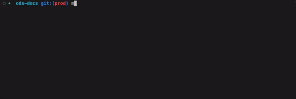

``` json
{
  "key": "value (1)"
}
```

1.  :man_raising_hand: I'm a code annotation! I can contain `code`, 


``` python
import pandas as pd 
import pyarrow as pa
import pyarrow.parquet as pq
import os
import sqlalchemy as sa
from concurrent.futures import ProcessPoolExecutor
import datetime
import json
import sys

# Function to load credentials, tables to rip, parquet root storage directory (1)
def load_config(config_name):
    with open('../config.json') as f:
        config = json.load(f)
    return config.get(config_name)

# Config name (config.json) fed as argument to to oracle2parquet.py CLI call
if len(sys.argv) != 2:
    print("Usage: python oracle2parquet.py <config_name>")
config_name = sys.argv[1]
config = load_config(config_name)
if not config:
    print(f"Config '{config_name}' not found in config.json in ../")
    sys.exit(1)
    
# Oracle Database Connection Configuration
oracle_username = config['oracle_username (1)']
oracle_password = config['oracle_password']
oracle_host = config['oracle_host']
oracle_port = config['oracle_port']
oracle_service_name = config['oracle_service_name']
oracle_charset = config['oracle_charset']
oracle_connection_string = (
    f'oracle+oracledb://{oracle_username}:{oracle_password}@'
    f'{oracle_host}:{oracle_port}/?service_name={oracle_service_name}'
)

# Define and load the Tables manifest
tables_manifest_path = config['tables_manifest_path']
tables_df = pd.read_csv(tables_manifest_path)

# Define and create the Parquet root storage directory
parquet_root_directory = config['parquet_root_directory']
os.makedirs(parquet_root_directory, exist_ok=True)

 # Create an SQLAlchemy engine & connect
engine = sa.create_engine(oracle_connection_string)
connection = engine.connect()

# List of SELECT statements to use for ripping
sql_list = []

# Loop through tables in manifest
for index, row in tables_df.iterrows():

    # Table metadata from manifest
    schema     = row['schema']
    table_name = row['table_name']
    table_key  = row['table_key']
    
    if table_key == 'none':
        sql_list.append(f" select * "
                        f" from {schema}.{table_name} "
                        f" where 1=1")
    else:
        for i in range(8):
            sql_list.append(f" select * "
                            f" from {schema}.{table_name} "
                            f" where mod({table_key}, 8) = {i}")

connection.close()

def process_query(sql):
    try:
        # Crude way of getting 'file_name'.  
        # And improvement would be passing a dict item per table with metadata
        from_position = sql.find(" from ")
        where_position = sql.find(" where ")
        if from_position != -1 and where_position != -1:
            # Extract the table name between 'from' and 'where'
            file_name = sql[from_position + len(" from "):where_position].strip()
        
        # Metadata for domain directory storage, total_rows for % complete calculation
        csv_row = tables_df['table_name'] == file_name.split('.')[1]
        domain     = tables_df.loc[csv_row, 'domain'].iloc[0]
        total_rows = tables_df.loc[csv_row, 'count'].iloc[0]
        
        # Creating/Emptying table_directory inside domain directory
        table_directory = os.path.join(parquet_root_directory, config_name + '/' + 
                                                               domain + '/' + 
                                                               file_name)
        os.makedirs(table_directory, exist_ok=True)
        files = os.listdir(table_directory)
        for file in files:
            file_path = os.path.join(table_directory, file)
            os.remove(file_path)
        
        # Chunking loop
        #   Chunk Size for Reading Data
        #     Each parquet file will contain up to chunk_size rows from one SELECT
        #     before creating a new file
        chunk_size = config['chunk_size']
        chunk_number = 0
        for chunk in pd.read_sql(sql, engine, chunksize=chunk_size, dtype_backend="pyarrow"):
            
            # Saving files named unique by timestamp
            timestamp = datetime.datetime.now().strftime("%H%M%S_%f")
            chunk_file_name = f"{file_name}_{chunk_number}_{timestamp}.parquet"
            chunk_file_path = os.path.join(table_directory, chunk_file_name)
            chunk.to_parquet(chunk_file_path, index=False)
            
            # Calculate % complete
            num_files = sum(1 for file in os.listdir(table_directory))
            percent = round(((num_files * chunk_size)/total_rows) * 100)
            if total_rows > chunk_size and percent < 100:
                print(f"{file_name} at {percent} %")
            else:
                print(f"{file_name} complete")
            
            chunk_number += 1
    except UnicodeDecodeError as e:
        print ({file_name} + e)
        pass

# Multi-threading
if __name__ == '__main__':

    max_threads = config['max_threads']
    with ProcessPoolExecutor(max_threads) as executor:
        futures = [executor.submit(process_query, sql) for i, sql in enumerate(sql_list)]
    for future in futures:
        future.result()
    print("Data processing complete.")
```

1.  :man_raising_hand: I'm a code annotation! I can contain `code`, __formatted
    text__, images, ... basically anything that can be written in Markdown.

  [placed in comments]: #adding-annotations
  [s2]: https://github.com/squidfunk/mkdocs-material/blob/87d5ca487b9d9ab95c41ee72813149d214048693/src/assets/stylesheets/main/extensions/pymdownx/_highlight.scss#L45